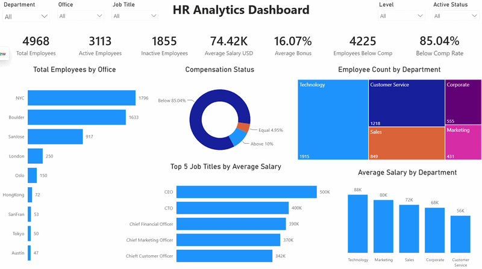

# HR Analytics - SQL & Power BI

## Project Overview

This project analyzes employee and compensation data using **PostgreSQL, SQL, Power BI, and DAX**.

The goal of the project was to clean and validate HR data, analyze workforce and compensation patterns, standardize salaries across multiple currencies, analyze employee turnover, and build an interactive Power BI dashboard.

---

## Dashboard



---

## Tools Used

- PostgreSQL
- SQL
- Power BI
- DAX

---

## Dataset

The project uses selected datasets from **The Company Data**:

- `CompanyData.tsv` - Core employee and HCM data
- `2021.06_job_profile_mapping.tsv` - Job profile and compensation reference data
- `2021.06_COL_2021.tsv` - Cost of living data

The project focuses on employee, job profile, salary, compensation, office, employment status, and turnover information.

---

## SQL Analysis

PostgreSQL was used to create the database structure, clean and validate the data, standardize salaries, and perform HR analysis.

### Data Preparation & Cleaning

The main data preparation steps included:

- Created the employee, job profile, cost of living, and exchange rate tables
- Checked for duplicate Employee IDs
- Checked NULL and blank values
- Standardized employee status into `Active` and `Inactive`
- Trimmed text columns
- Investigated missing state values
- Checked termination dates against employee start dates
- Replaced placeholder termination dates with `NULL` for active employees
- Validated employee age against date of birth
- Reviewed unusual bonus percentages
- Reviewed salary ranges across multiple currencies
- Validated employee job profiles against the reference table
- Validated office values against the cost of living table

### Currency Standardization

Employee salaries were stored in multiple currencies:

- USD
- GBP
- JPY
- NOK
- HKD

To make salary comparisons consistent, I created an exchange-rate table and standardized employee salaries to USD.

A SQL view called `employees_usd` was created using:

```sql
salary_usd = salary * rate_to_usd
```

This standardized salary was also used in Power BI.

### SQL Techniques Used

- `JOIN`
- `LEFT JOIN`
- `CASE`
- `CTE`
- `GROUP BY`
- Aggregate functions
- `ROW_NUMBER()`
- Data validation queries
- Views

---

## Power BI Dashboard

After preparing the data in PostgreSQL, the data was connected to Power BI to build a two-page interactive HR analytics dashboard.

### Data Model

Relationships were created between:

- Employees and Job Profiles
- Employees and Cost of Living
- Employees and Exchange Rates

A disconnected `HR Year` table was also created to support year-based turnover analysis.

### Dashboard Pages

#### HR Overview

The HR Overview page includes:

- Total Employees
- Active Employees
- Inactive Employees
- Average Salary USD
- Average Bonus
- Employees Below Compensation
- Below Compensation Rate
- Total Employees by Office
- Employee Count by Department
- Compensation Status
- Top 5 Job Titles by Average Salary USD
- Average Salary USD by Department

#### Turnover Analysis

The Turnover Analysis page includes:

- Turnover Rate
- Terminations in Year
- Employees in Year
- Turnover Rate by Department
- Turnover Rate by Year
- Terminations by Office

The year selector updates the selected-year KPIs and breakdowns, while the turnover trend chart remains visible across all years for historical comparison.

### Key DAX Measures

Some of the key DAX measures used in the dashboard include:

#### Average Salary USD


#### Employees Below Compensation


#### Employees in Year


#### Turnover Rate


### Interactive Filters

The **HR Overview** page can be filtered by:

- Department
- Office
- Job Title
- Level
- Active Status

The **Turnover Analysis** page can be filtered by:

- Year
- Department
- Office
- Job Title
- Level

---

## Key Insights

- The company has **4,968 employees**
- **3,113 employees are active**
- **1,855 employees are inactive**
- Technology is the largest department with **1,915 employees**
- NYC has the highest employee count with **1,796 employees**
- The average standardized salary is approximately **$74.42K**
- Technology has the highest average department salary at approximately **$88K**
- Customer Service has the lowest average department salary at approximately **$56K**
- **4,225 employees** are below the reference compensation level
- The below compensation rate is approximately **85.04%**
- The average employee bonus is approximately **16.07%**
- The CEO has the highest average salary among job titles at approximately **$500K**

---

## Business Recommendations

- Review compensation alignment for the **4,225 employees (85.04%)** below the reference compensation level, prioritizing the largest gaps by job title, level, and department.
- Monitor turnover rates by department to identify areas with unusually high employee exits and investigate the underlying factors.
- Compare turnover patterns with compensation status to determine whether employees below reference compensation also experience higher exit rates.
- Review office-level termination patterns together with office headcount before identifying locations with potential retention concerns.
- Review workforce concentration across major departments and offices to support staffing and resource planning.
- Monitor compensation alignment, turnover, and workforce distribution regularly to identify emerging HR risks.

---

## Project Files

### SQL

- [Database Setup](SQL/01_database_setup.sql)
- [Load Data](SQL/02_load_data.sql)
- [Employee Data Quality](SQL/03_employee_data_quality.sql)
- [Job Profiles Data Quality](SQL/04_job_profiles_data_quality.sql)
- [Cost of Living Data Quality](SQL/05_cost_of_living_data_quality.sql)
- [Currency Standardization](SQL/06_currency_standardization.sql)
- [HR Analysis](SQL/07_hr_analysis.sql)

### Power BI

- [Power BI Dashboard File](HR.pbix)

### Dashboard Demo

- [HR Dashboard GIF](HR_Dashboard.gif)

---

## Assumptions & Notes

- Salaries were standardized to USD before cross-currency salary analysis
- The compensation field from the job profile mapping was treated as the reference compensation value
- Placeholder termination dates for active employees were converted to `NULL`
- Missing state values were retained when the field was not applicable to the employee's location
- The turnover metric is calculated as employees terminated during the selected year divided by employees who worked at any point during that year
- The `HR Year` table is disconnected from the employee table and is used as a year selector for turnover measures

---

## Dataset Source

**The Company Data - Koluit**

https://github.com/Koluit/The_Company_Data

---

## Conclusion

This project demonstrates an end-to-end HR analytics workflow using SQL and Power BI.

SQL was used for database setup, data cleaning, validation, transformation, currency standardization, and HR analysis.

Power BI was used to create the data model, DAX measures, interactive filters, workforce and compensation analysis, and year-based turnover analysis.

The project demonstrates how HR data can be transformed into actionable workforce, compensation, and employee turnover insights.