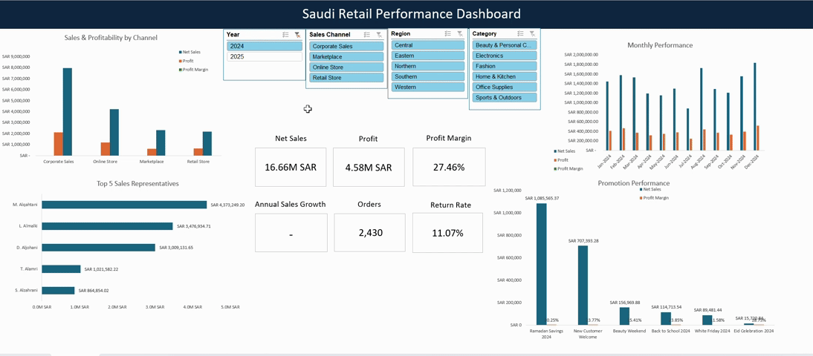

# Retail Sales Performance Analysis

## Project Overview

An Excel-based retail sales analysis project using 2024–2025 transaction data.

The project focuses on sales growth, profitability, product performance, returns, promotions, sales channels, and customer segments, with the results presented in an interactive dashboard.

## Tools

- Microsoft Excel
- Power Query
- Power Pivot
- DAX
- Pivot Tables
- Pivot Charts
- Slicers

## Key Questions & Answers

### 1. Did sales growth lead to higher profitability?

**Answer:**  
Net Sales increased by **3.36%**, while Profit increased by only **1.13%**. Profit Margin declined from **27.46% to 26.87%**, showing that higher sales did not translate into the same level of profit growth.

### 2. What affected the decline in Profit Margin?

**Answer:**  
Product Cost Rate increased from **71.94% to 72.53%**, while discounts and returns also increased.

### 3. Which sales channels performed best?

**Answer:**  
Corporate Sales generated the highest Net Sales at approximately **8.26M SAR**, while Retail Store achieved the highest Profit Margin at **31.42%**.

### 4. Which products contributed to declining profitability?

**Answer:**  
Apex Notebook A112 was the largest contributor to the decline in laptop profitability, with profit decreasing by approximately **105.3K SAR**.

### 5. Where were returns increasing?

**Answer:**  
Footwear Return Rate increased from **8.79% to 14.57%**.

### 6. Were high-sales promotions also profitable?

**Answer:**  
Ramadan Savings generated the highest promotional sales, while Back to School achieved a stronger Profit Margin.

### 7. Who were the strongest sales representatives?

**Answer:**  
M. Alqahtani ranked first in 2025 with approximately **3.92M SAR** in Net Sales.

### 8. How did customer segments perform?

**Answer:**  
Corporate customers generated higher sales per customer, while Consumers had a larger customer base, higher Profit Margin, and lower Return Rate.

## Business Recommendations

- Review product costs and pricing for products with declining margins.
- Investigate the increase in Footwear returns, especially product description, sizing, and delivery-related issues.
- Evaluate promotions based on profitability, not sales volume alone.
- Study the practices of high-performing sales representatives and apply successful approaches across the sales team.
- Focus on high-margin sales channels while monitoring channels with higher return rates.

## Dashboard

The interactive dashboard allows users to filter performance by:

- Year
- Sales Channel
- Region
- Category

### KPIs

- Net Sales
- Profit
- Profit Margin
- Annual Sales Growth
- Orders
- Return Rate

## Conclusion

Sales increased in 2025, but profitability did not grow at the same rate.

The analysis highlights the importance of evaluating business performance using both sales growth and profitability, while also considering product costs, returns, promotions, and channel performance.
[Download Excel Project](Retail_Sales_Performance_Analysis.xlsx)