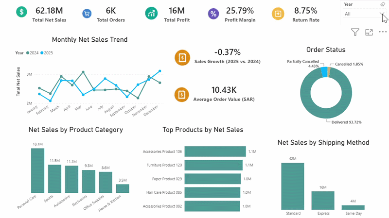
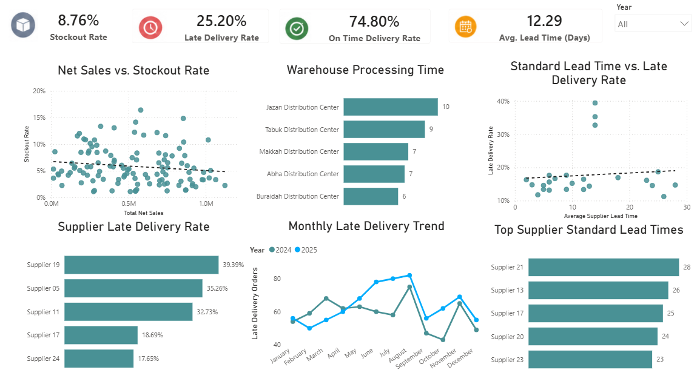

# Supply Chain Performance Dashboard - Power BI

An interactive Power BI dashboard for analyzing sales, profitability, delivery performance, suppliers, warehouses, stockouts, and returns.

## Key Results

- **Net Sales:** SAR 62.18M
- **Profit:** SAR 16.04M
- **Profit Margin:** 25.79%
- **Total Orders:** 5,960
- **Return Rate:** 8.75%
- **Stockout Rate:** 8.76%
- **On-Time Delivery:** 74.80%
- **Late Delivery:** 25.20%

## Charts

- **KPI cards** provide a quick executive view of sales, profit, orders, returns, stockouts, and delivery performance.
- **Line charts** compare monthly sales, profit, and late deliveries across 2024 and 2025.
- **Bar and column charts** rank categories, products, regions, suppliers, warehouses, and shipping methods.
- **Scatter plots with trend lines** examine the relationships between discounts, sales, profit margin, stockouts, and supplier lead time.
- **The order-status donut chart** separates fully delivered, partially cancelled, and cancelled orders without overlap.

## Data Cleaning & Validation

- Removed zero and negative quantities to protect sales, cost, and profit calculations.
- Recalculated gross sales, net sales, product cost, and profit using validated fields.
- Counted unique order IDs instead of order lines to prevent duplicated KPIs.
- Separated fully delivered, partially cancelled, and fully cancelled orders without overlap.
- Created mutually exclusive on-time and late-delivery groups, producing rates that total 100%.
- Used delivered orders as the eligible population for returns, producing an accurate 8.75% return rate.
- Validated the star schema and active many-to-one relationships to ensure reliable filtering.
- Disabled year filtering for static supplier and warehouse reference metrics.

## Business Questions

- Which product categories generate the highest sales and profit?
- Which customer region contributes the most profit?
- Which suppliers have the highest late-delivery rates?
- How frequently do stockouts affect customer orders?
- Does supplier standard lead time explain late-delivery performance?
- Do higher discounts improve net sales or reduce profit margin?

## Key Business Insights

- Personal Care generated the highest sales and profit.
- The Western region produced the highest profit.
- Suppliers 19, 05, and 11 had the highest late-delivery rates.
- Delivery reliability is the main operational risk, with 25.20% of delivered orders arriving late.
- Supplier standard lead time did not strongly explain late-delivery performance.
- Discounts showed a weak negative relationship with net sales and profit margin.

## Tools

Power BI · Power Query · DAX · Data Modeling · Data Validation · Business Analysis

## Open the Dashboard

Download [the Power BI file](Supply%20Chain.pbix) and open it in Power BI Desktop.

