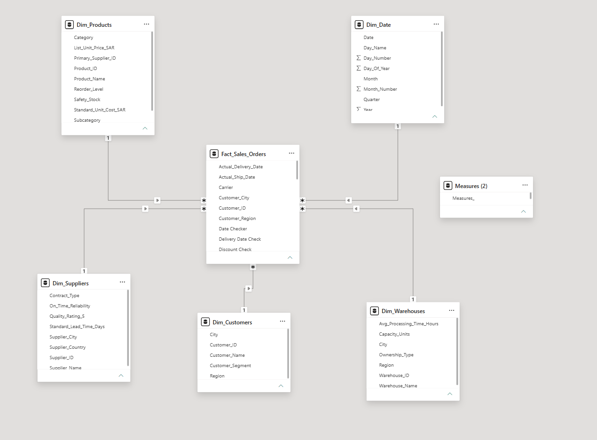
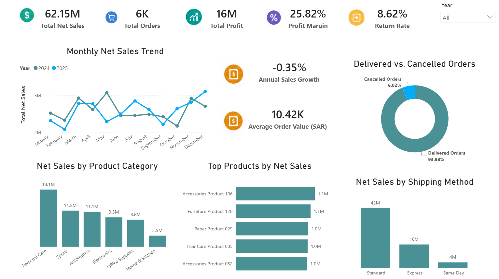
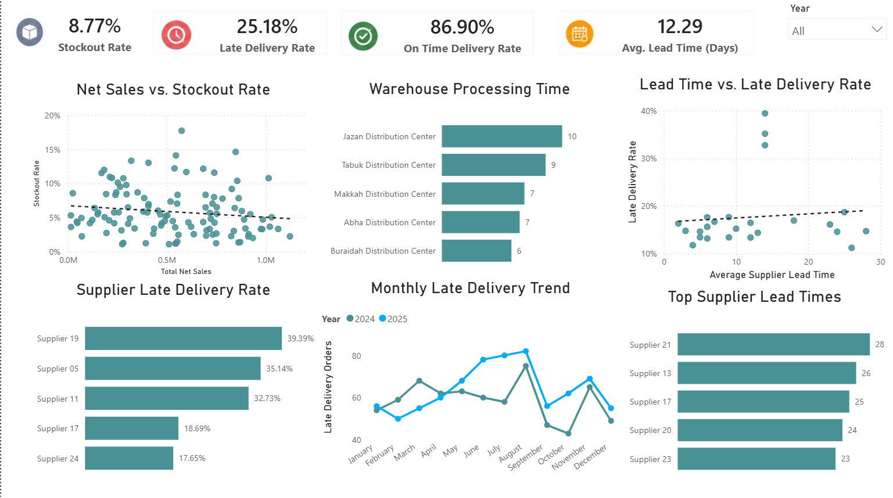
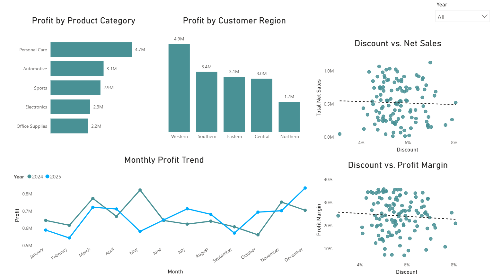

# Supply Chain & Sales Dashboard | Power BI

## Project Overview

This Power BI project analyzes **sales, profitability, inventory, supplier performance, warehouse efficiency, and delivery operations**.

The project covers the workflow from data cleaning and validation to data modeling, DAX calculations, dashboard development, insights, and recommendations.

---

## Tools

- Power BI
- Power Query
- DAX
- Data Cleaning
- Data Validation
- Data Modeling
- Data Visualization

---

## Dashboard Preview

The report contains three interactive pages:

1. Sales Overview
2. Delivery, Suppliers & Inventory
3. Profitability & Business Drivers

---

## Data Cleaning & Validation

The dataset was prepared and validated in Power Query before analysis.

### Data Cleaning

- Checked missing and null values
- Checked duplicate records
- Corrected data types
- Standardized categorical values
- Prepared date fields

### Data Validation

- Date validation
- Delivery date checks
- Quantity checks
- Discount checks

### Result

A clean and consistent dataset ready for modeling and analysis.

---

## Data Model

The model is centered around `Fact_Sales_Orders` and connected dimension tables:

- `Dim_Date`
- `Dim_Products`
- `Dim_Customers`
- `Dim_Suppliers`
- `Dim_Warehouses`

---

## DAX Measures

### Annual Sales Growth

Measures the percentage change in net sales between 2024 and 2025.

### Average Order Value

Measures the average net sales generated per order.

### Late Delivery Rate

Measures the percentage of delivered orders that were delivered late.

### Profit Margin

Measures profit as a percentage of total net sales.

---

## Dashboard Pages

### Sales Overview

Sales trends, product performance, annual growth, average order value, shipping methods, and delivery status.

### Delivery, Suppliers & Inventory

Supplier performance, stockouts, lead times, late deliveries, and warehouse processing times.

### Profitability & Business Drivers

Profit performance by category and customer region, with discount analysis against net sales and profit margin.

---

## Key Insights

- Total Net Sales reached approximately **SAR 62.15M**.
- Total Profit reached approximately **SAR 16M**, with a **25.82% Profit Margin**.
- Annual Sales Growth was approximately **-0.35%**, indicating relatively stable sales between 2024 and 2025.
- **Personal Care** generated the highest net sales and total profit.
- The overall Stockout Rate was approximately **8.77%**.
- **Supplier 19** recorded the highest Late Delivery Rate at approximately **39%**.
- **Jazan Distribution Center** had the highest processing time among the warehouses displayed.
- Supplier Lead Time showed only a weak relationship with Late Delivery Rate.
- Higher discounts did not show a strong positive relationship with Net Sales.
- Higher discounts showed a negative trend with Profit Margin.

---

## Recommendations

- Review suppliers with high Late Delivery Rates and investigate the causes of delays.
- Investigate warehouse processing bottlenecks.
- Improve inventory planning for products affected by stockouts.
- Evaluate discount strategies based on their impact on sales and Profit Margin.
- Prioritize high-performing product categories and customer regions.

